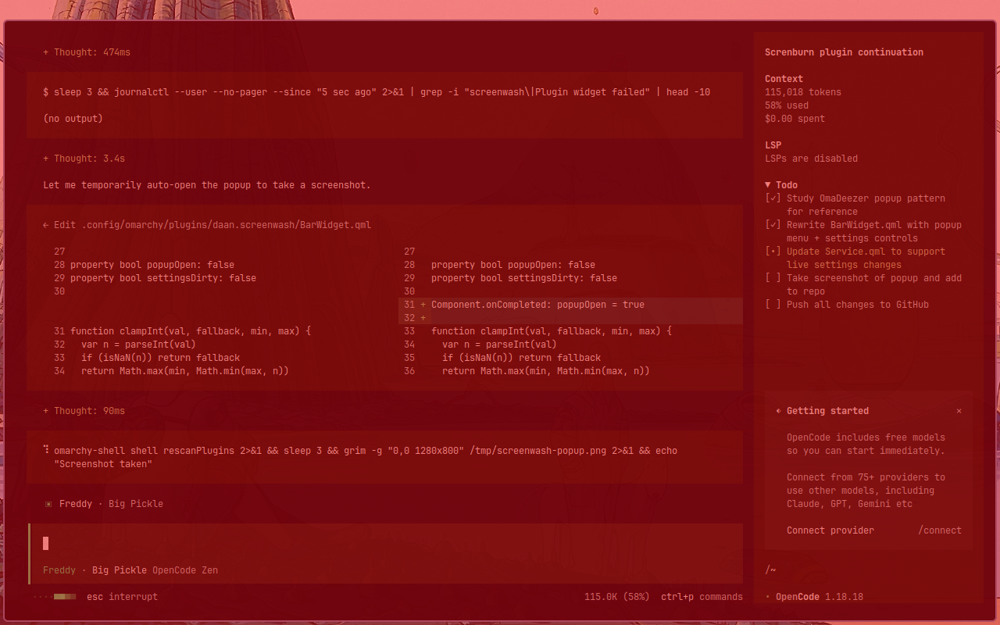
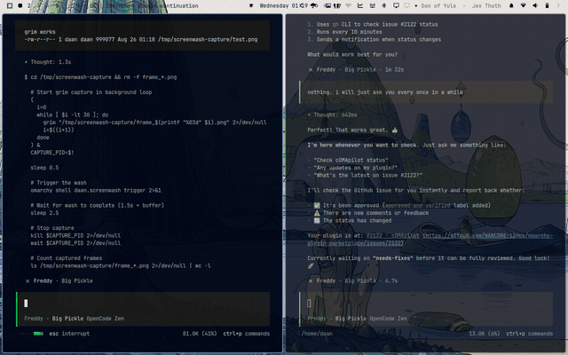

# Screen Wash — Omarchy Burn-In Prevention Plugin

Periodically washes the screen with cycling solid colors or dims it to prevent burn-in during long sessions.



## Install / Remove

```
omarchy plugin add Deunnis/omarchy-screenwash
```

```
omarchy plugin remove daan.screenwash
```

## Features

- Two wash modes: **wash** (cycles through R→G→B→white) and **dim** (fades a black overlay)
- Click the monitor icon (󰍹) in the bar to open the settings popup
- Toggle on/off, switch mode, set interval and duration — all from the popup
- Automatically skips wash when a fullscreen window is active
- Persistent settings across restarts



## Settings

All settings can be changed from the bar popup menu:

| Setting | Options | Default | Description |
|---|---|---|---|
| Mode | Wash / Dim | Wash | Wash cycles solid colors; dim fades a black overlay |
| Interval | 15m / 30m / 60m / 120m | 30m | Minutes between screen washes |
| Duration | 0.5s / 1s / 1.5s / 3s | 1.5s | How long the wash overlay stays visible |
| Skip if fullscreen | On / Off | On | Skip the wash if a fullscreen window is active |

## IPC Commands

```
omarchy shell daan.screenwash trigger
```

```
omarchy shell daan.screenwash status
```

## Manual Installation

```bash
git clone https://github.com/Deunnis/omarchy-screenwash.git ~/.config/omarchy/plugins/daan.screenwash
```

Then add `{ "id": "daan.screenwash" }` to both the `plugins` array and the bar layout in `~/.config/omarchy/shell.json`.

## Manual Removal

```bash
rm -rf ~/.config/omarchy/plugins/daan.screenwash
```

Then remove `{ "id": "daan.screenwash" }` from the `plugins` array and bar layout in `~/.config/omarchy/shell.json`.

## License

MIT — see [LICENSE](LICENSE).
